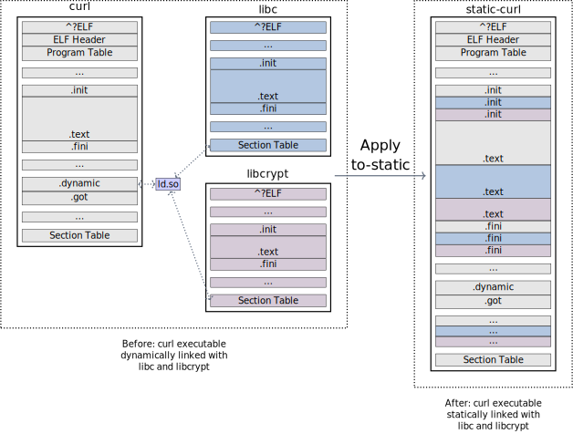
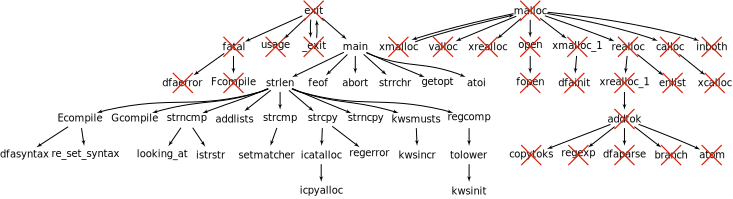
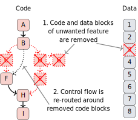
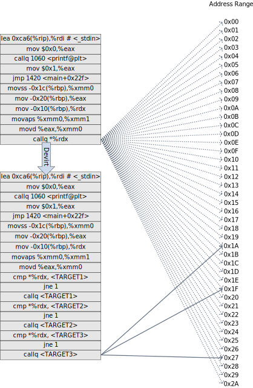

To-static
=========

TRL: 4

Transforms to convert dynamically linked executables to statically linked.



## Abstract
To-static is a binary rewriting software transformation that takes a
COTS binary executable along with the dynamic libraries it would load
at runtime and consolidates them all into a single statically linked
binary executable.  This process is useful in cases where the
equivalent statically linked executable cannot be built from source:
for example, because the original source code or build system are
unavailable, or are available but cannot be modified to accommodate
static linking.  The to-static transform confers all the benefits of
static linking---simplified distribution, reduced runtime
requirements, streamlined cross-library function calls---while also
ensuring that any subsequent binary transformations---e.g., control
flow integrity (CFI), hardening, debloating, optimization---will
automatically apply to library code as well as to the main executable
code.

## Use Cases

### Post-deployment static linking
The installation of software with dynamic libraries can be a
complicated task sometimes leading to cascading issues on the host
system, conflicts with existing libraries, and surprising bugs due to
particulars of the versions of the libraries on the host system
(i.e. "DLL Hell").  GrammaTech's to-static transform allows a system
to be developed using dynamic libraries (easier development; faster
and simpler builds) but deployed as a single self-contained statically
linked executable--without requiring alterations (or access) to the
software source or build system for the core package or any libraries.


GTIRB Reachable
===============

TRL: 6

Identify code in GTIRB which is transitively reachable from a set of entry
points.



## Abstract

GTIRB Reachable is a library to assist in a binary rewriting software transformation
which takes a COTS binary executable and a set of entry points and rewrites the
executable to remove all code which is not transitively reachable from the given
set of entry points.  Reachability is calculated by following the control flow
graph of the binary and identifying symbolic references.  This may be
particularly useful when reducing library code as libraries often include much
more functionality than what is needed for any particular application.

## Use Cases

### Automated Debloating
Software typically includes the union of all functionality needed by
any user.  So any given users ends up with more functionality—and
consequently more bugs, inefficiency, and attack surface—than they
need.  (A classic example is JavaScript engines in PDF readers; most
people never need it, but everyone pays for it in terms of
vulnerability to malicious scripts.) This problem is multiplied by
modern development practices which encourage developers to pull in
external libraries which provide much more functionality than required
by any one application.

GrammaTech provides tools for automatically rewriting binary
executables and libraries to (1) combine multiple binaries into a
single executable which is easily deployed, (2) stripping all unused
functionality from binaries, and (3) enabling users to selectively
remove features from binaries.


Reduce
======

TRL: 4

Reduce a binary executable through either explicit or search-based
basic block removal.



## Abstract
Reduce is a binary rewriting software transformation that takes a COTS
binary executable and the executable to remove unwanted code and data.
The code and data to be removed may be specified in two ways.  First,
an explicit list of blocks to remove can be provided.  Second, a
dynamic test of the binary may be provided and as many blocks as
possible will be removed while retaining functionality against the
provided test.  After removal of unwanted code and data the control
flow is re-routed around removed code blocks, and the resulting binary
image is compacted.  This can be useful when software includes
undesirable or unused features, especially when those features have a
negative impact on software performance or security.


DeVirt
=======

TRL: 0

Devirtualize indirect jumps and calls to provide additional control flow protection.

## Abstract

## Dependencies
[GTIRB](https://grammatech.github.io/gtirb/)<br>
[GTIRB-Capstone](https://git.grammatech.com/rewriting/gtirb-capstone)

## Usage

```
python3 __main__.py [-h] [-v] [-d] in.gtirb out.gtirb
```
  - `in.gtirb` - GTIRB input file
  - `out.gtirb` - GTIRB output file



